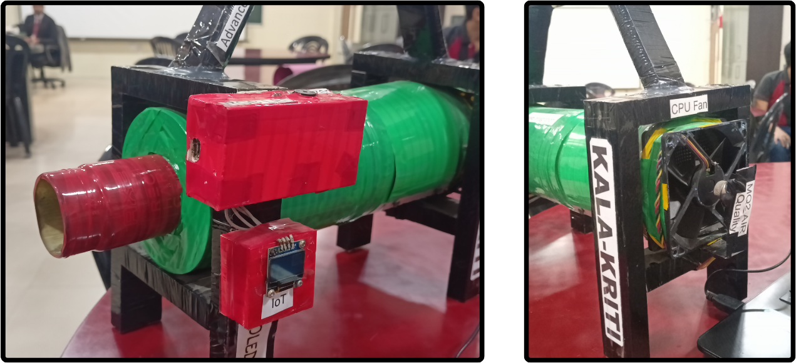
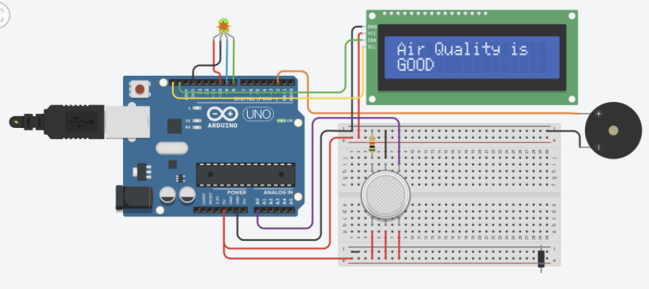

# KALA-KRITI

**An Intelligent Exhaust Monitoring System for Detecting and Reducing Carbon Emissions from Fuel-Powered Vehicles**

Carbon emissions from fuel-powered vehicles are one of the top contributing factors to the dangerously increasing levels of harmful gases in the atmosphere. Some vehicle owners disregard their vehicle’s emissions, while others think these emissions don’t have a significant effect on the environment. The problem is further amplified when considering the massive number of vehicles using fossil fuels. KALA-KRITI aims to address this issue by providing an active monitoring system for detecting and reducing carbon emissions.

## Theory

KALA-KRITI employs advanced technology, including activated charcoal filtration, real-time air quality sensing, and microcontroller integration, to effectively reduce carbon emissions from vehicles. The system also alerts users and authorities about elevated emissions levels.

The project's primary motive is to:

- Address the pressing issue of carbon emissions from vehicles.
- Foster a sense of environmental responsibility among vehicle owners.
- Promote sustainable transportation practices for a cleaner future.

## Features

- Activated charcoal filtration for efficient carbon emission reduction.
- Real-time air quality sensing for accurate monitoring.
- Microcontroller integration for smart and automated control.

## Project Dependencies & Components

### Hardware Components

- NodeMCU
- Carbon Absorbers
- MQ2 Air Quality Sensor
- Buzzer
- LCD
- LED Lights
- CPU Fan
- Relay
- Jumper Wires

### Programming Tech Stack

- C Programming language
- Typescript
- Node.js/Express.js
- Next.js
- Tailwind CSS

## Working of the Project

- **Kala-Kriti Overview:**

  - Kala-Kriti is an Intelligent Exhaust Monitoring System designed for Vehicle Carbon Emission Detection and Prevention.

- **Carbon Emission Filtration:**

  - It seamlessly integrates into a vehicle's exhaust system and features layers of carbon absorbers to filter harmful emissions from fuel-powered vehicles.

- **Alarm System Activation:**

  - If the emitted gas remains harmful after filtration, the MQ2 air quality sensor activates an alarm system with a red RGB light and a buzzer, signaling potential environmental hazards.

- **Airflow Dynamics Control:**

  - It incorporates a relay and a CPU fan as essential components within the NodeMCU setup. The relay serves a pivotal role in controlling the airflow dynamics, facilitating the directed movement of air from the vehicle into the MQ2 sensor.

- **Microcontroller and API Integration:**

  - The system utilizes a NodeMCU as the microcontroller, interfacing with an API developed in Express.js for real-time communication between the monitoring system and the server. This ensures prompt data processing and analysis.

- **Data Storage and Analytics:**

  - All sensor data is persistently stored in a MongoDB database, facilitating historical tracking and comprehensive emission analytics.

- **Web-Based Application:**

  - The collected data is presented on a web-based application accessible to both the vehicle owner and government authorities.

- **Notification System:**
  - Kala-Kriti proactively notifies the vehicle owner and relevant government authorities about excessive carbon emissions from a specific vehicle.

## The motivation behind this project...

While researching and updating ourselves with recent automobile technologies, we found that there is currently no technology that deals with carbon emissions. We felt that the lack of such a system in such important aspects of our lives is dangerous, both to humans and the environment. On searching for similar projects on online platforms, we weren’t able to find any idea/project that actively monitored the smoke emissions in combination with the automobile’s own technologies. Our prototype deals with this problem in an effective and easy-to-implement way. Our team has a vision to create a healthier, happier, and safer environment for us and our future generations. We want to bring a change to the current state of carbon emissions by making further improvements to this project and implementing it where required.

## Future Implementations

This project can also be operated standalone in the future, meaning that this project can be implemented in almost any place which requires an active monitoring of carbon emissions. Possible use cases could involve    
- Factories
- Train Engines 
- Chimneys
- Incrinators
etc. 
We are also planning on leveraging AI for the implementation of Area Toxicity Rate Prediction that would enable us to predict the area most prone to toxic gas emission due to fossil fuel powered vehicles.
We are also planning to integrate a GPS module to inform the relevant authorities about the exact location of the polluting vehicle, in case the owner doesn’t take necessary actions.

## Conclusion

We devised this idea of  “Kala-Kriti” to reduce the carbon footprint and to spread awareness about it. If implemented correctly, this idea will surely help in the conservation of the environment.

